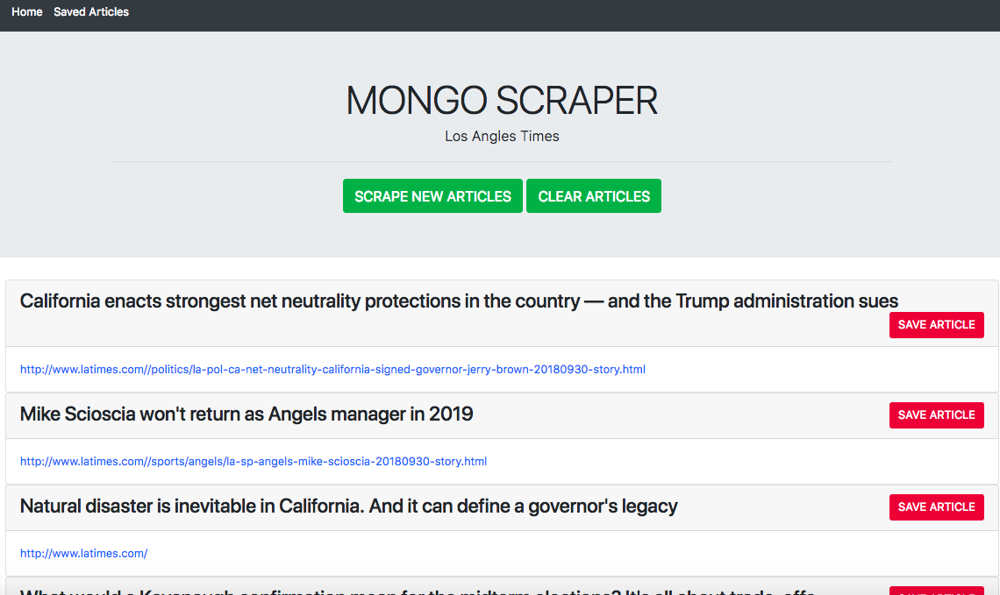

# All-the-News
Assignment_Mongo Scraper_All-the-News

# Link to deployed site
* https://github.com/lalatw/All-the-News
* https://intense-anchorage-21247.herokuapp.com/


# Images



# Technology used
* HTML
* CSS
* Bootstrap
* javascript
* jQuery
* node.js
* express
* express-handlebars
* cheerio
* mongoose
* mongoDB
* Heroku


# npm dependencies

```
  "dependencies": {
    "body-parser": "^1.18.3",
    "cheerio": "^1.0.0-rc.2",
    "express": "^4.16.3",
    "express-handlebars": "^3.0.0",
    "mongoose": "^5.2.17",
    "request": "^2.88.0"
  }
```

# Code snippets

```
// A GET route for scraping the la times website
app.get("/api/scrape", function (req, res) {
    request("http://www.latimes.com/", function (error, response, html) {
        var $ = cheerio.load(html);
        var results = [];

        $("h5").each(function (i, element) {
            var title = $(element).text();
            var link = $(element).children("a").attr("href");

            results.push({
                title: title,
                link: link
            });
            console.log(results);
        
            db.Article.create(results)
             .then(function(dbArticle) {
                 console.log(dbArticle);
             })
             .catch(function(err) {
                return res.json(err)
            })    
        });
        res.send("Scrape Complete");
    });
});

```


# Learning points
* Apply mongooes to use mongoDB for database
* Use cheerio to scrape a website's data as needed
* Create api routes and html routes.
* Apply get and post methods.
* Apply Node.js to run backend. 
* Run npm install to use pre-built packages of modules.
* Deploy a Node web server to Heroku.


# Author 
[Shuhan Laura Lee](https://github.com/lalatw/All-the-News)


# License
Standard MIT License